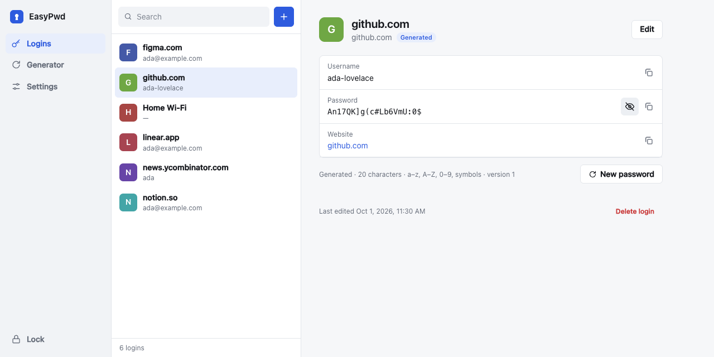

# EasyPwd

**Remember one passphrase. Get the same strong password for every site, on any device.**

EasyPwd is an offline Chrome extension that calculates a unique password for
each website from your email, your master passphrase, and the site's name.
Nothing needs to be synced: install EasyPwd on another computer, enter the same
email and passphrase, and you get the same passwords. Passwords you can't
change are kept in a local encrypted vault. No account, server, cloud sync,
analytics, or website access.

**Website and live demo:** https://xianyangwong.github.io/easypwd/



**Status: preview. Not independently security-audited. Use test
credentials while evaluating it, not your only copy of important passwords.**

## Why this project exists

In 2020, EasyPwd started as a small server-side generator built on one idea:
*you should only need to remember the website and one master key.* Revisiting
it showed what a purely calculated password can't do on its own:

| Problem with a pure generator | How EasyPwd handles it |
|---|---|
| A leaked password can't be changed without changing the master key. | Each site has a **version**. **New password** moves to the next version and keeps the previous one visible until you've updated the site. |
| Sites have rules, such as "max 16 characters" or "no symbols". | Length and character groups are set **per site**. |
| Existing passwords, PINs, and Wi‑Fi keys can't be calculated. | They're stored as **saved logins** in the encrypted vault. |
| A typo in the master key silently gives wrong passwords. | A four-word **key fingerprint** is shown on every device. Different words mean a typo. |
| The secret was sent to a server. | Everything runs in the extension, with no network access. |

It is a small open-source engineering project, not a claim to replace mature,
audited password managers. Its priorities are a published, tested derivation
format, minimal permissions, and recoverable data.

## How it works

```text
email + passphrase ──PBKDF2 (600k)──► root key ──HKDF──┬──► site key ──HMAC(site, version, rules)──► password
                                                       ├──► vault key (AES-256-GCM, saved logins)
                                                       └──► 4-word fingerprint
```

The site name is normalized first, so `https://www.github.com/login` and
`github.com` give the same password. The exact algorithm and test vectors are
in [SECURITY.md](SECURITY.md#generated-passwords); `test/vault.test.js` checks
the extension against an independent implementation built on Node's `crypto`
module.

For a login that uses the default rules (20 characters, all character groups,
version 1), you can lose this browser, its vault, and every backup, and still
get the password back from your email, passphrase, and the site name. The vault
only records exceptions: custom rules, newer versions, usernames, notes, and
saved passwords.

## Features

- **Generated logins.** Type a site in the search box and press Enter. The
  password is calculated, not stored, and is the same on every device.
- **Password versions.** Rotate a generated password with **New password**. The
  previous version stays available until you rotate again.
- **Per-site rules.** Length (8–64) and character groups for sites with limits.
- **Key fingerprint.** Four words that confirm you typed the same email and
  passphrase as on your other devices.
- **Saved logins.** Store passwords you can't change in the encrypted vault.
  Usernames, notes, and websites can be added to either kind.
- **Health hints.** Flags saved passwords that are reused or shorter than 12
  characters.
- **Generator.** Random passwords of 8–64 characters from the character groups
  you choose, with an entropy estimate.
- **Auto-lock.** Locks after 1, 5, 15, or 30 minutes of inactivity, when you
  click **Lock**, or when the vault tab is closed or reloaded.
- **Backups.** Export an encrypted JSON backup; restore one from the lock screen
  or Settings. Backups are decrypted and validated before anything is replaced.
- **Import from Chrome.** Add logins from a Google Password Manager CSV export.
  Duplicates and invalid rows are skipped.
- **Change passphrase.** Re-encrypts the vault with a new key and salt. Every
  generated password depends on the passphrase, so generated logins are first
  converted to saved logins with their current passwords; nothing stops working.
- **Safe multi-tab use.** A tab never silently overwrites newer data saved in
  another tab; it locks instead.
- Light and dark themes; works in narrow windows.

Site matching, page filling, automatic login capture, cloud sync, and recovery
keys are **not implemented**.

## Install locally

The extension runs directly from `extension/`. No dependencies or build tools
are needed to install it.

1. Download or clone this repository.
2. Open `chrome://extensions` in Chrome 120 or later.
3. Enable **Developer mode**.
4. Select **Load unpacked** and choose this repository's `extension` directory.
5. Click the EasyPwd toolbar action (pin it if desired). The vault opens in a tab.
6. Enter your email (or any name you'll remember) and a strong master passphrase
   of at least 15 characters. Write down the four-word fingerprint.
7. Type a site, such as `github.com`, in the search box and press Enter.

On another computer, repeat the steps with the same email and passphrase. If the
fingerprint matches, generated passwords match too.

This is a developer-mode preview, not a Chrome Web Store release. The extension
uses browser-local storage, not a file shared between browser profiles. Keep the
installation directory in a stable location; loading a different unpacked
directory may create a different extension installation and separate storage.

## Back up before you need to

In **Settings**, select **Export** after important changes, then check that the
downloaded JSON file exists. Store a copy outside this browser profile, ideally
on another device or offline medium.

To restore, choose **Restore from backup** on the lock screen or in Settings,
pick the backup file, and enter the master passphrase it was created with. EasyPwd validates the format and decrypts the backup
before replacing local data. Restoration **replaces**, rather than merges, the
current vault. Export the current vault first.

Backups remain encrypted, but still allow offline guessing of a weak master
passphrase. The email or name is stored unencrypted in the vault and backups. Deleting an entry does not remove it from old backups.

Changing the master passphrase does not change existing backups; they still
open with the passphrase they were created with. Export a new backup afterwards.

**There is no passphrase recovery.** **Forgot passphrase?** on the lock screen
can only delete the vault so you can start over or restore a backup. Losing your master passphrase, uninstalling the
extension, deleting the Chrome profile, or losing the device without a usable
backup can mean permanently losing your passwords. Chrome does not promise
crash-proof or disk-failure-proof storage.

## Security and permissions

Everything uses native Web Crypto: PBKDF2-HMAC-SHA-256 with 600,000 iterations,
HKDF-SHA-256, HMAC-SHA-256, and AES-256-GCM with a new random 12-byte nonce per
write. PBKDF2 is chosen for a dependency-free browser-native version; it is not
a memory-hard KDF such as Argon2id. Formats are versioned and strictly validated.

Calculated passwords have a tradeoff you should understand: anyone who learns
your passphrase and email can calculate every generated password, past and
future, without your vault. A single leaked site password also lets an attacker
test passphrase guesses offline. A long, unique passphrase is essential. See
[SECURITY.md](SECURITY.md) for the threat model.

| Permission | Reason |
|---|---|
| `storage` | Store the encrypted vault in `chrome.storage.local`. |
| `clipboardWrite` | Copy a password after an explicit user action. |

There are no host permissions, content scripts, remote scripts, or network
requests. The action's background worker only opens/focuses the vault page.
Master passphrases and decrypted credentials are not sent to it.

Unlocked data and a non-extractable encryption key live in the vault page's
memory. Closing/reloading locks it. The page checks idle expiry on a timer, on
focus/visibility changes, and before protected actions; background timers may be
delayed by Chrome. JavaScript cannot guarantee physical memory zeroization.
Copied passwords remain on the system clipboard; clear it yourself.

## Development

Use Node.js 22 or later. There are no npm dependencies.

```sh
npm test
npm run check
npm run build
```

The build packages runtime files and the license in `dist/easypwd`, which can also be loaded
unpacked. Reload the extension on `chrome://extensions` after changing source,
then close/reopen the vault page. Export a backup before updating.

`npm run build` also copies `extension/crypto.js` to `docs/crypto.js`, which the
website demo uses; `check` fails if they differ.

Tests cover pinned derivation vectors, an independent reference implementation,
site and identity normalization, format 1 migration, encrypted round trips,
re-keying, Unicode passphrase normalization,
tampering, wrong passphrases, backup and entry validation, CSV import, password
generation, concurrent writes and deletes, and failed storage writes.
`check` verifies JavaScript syntax, DOM references, permissions, and the network
policy. See [CONTRIBUTING.md](CONTRIBUTING.md) for manual acceptance checks.

## Upgrading

- **From EasyPwd 0.1 (format 1 vaults).** Unlocking asks for an email or name
  once and upgrades the vault to format 2. Existing logins stay saved logins.
  Format 1 backups can still be restored. Export a new backup afterwards.
- **From the 2020 prototype.** Its derivation algorithm is not reproduced.
  Add those passwords as saved logins, or rotate them to generated ones.

## License

MIT. See [LICENSE](LICENSE).
